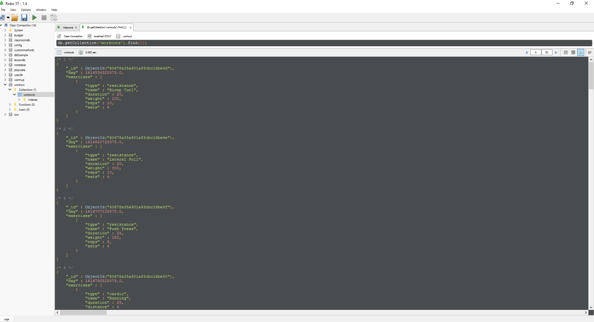

# Workout Tracker

## Table of contents

- [Description](#Description)
- [Acceptance Criteria](#AcceptanceCriteria)
- [Resources](#Resources)
- [Screenshot](#Screenshot)
- [Walkthrough](#walkthrough)
- [Links](#Links)
- [Heroku Deploy](#HerokuDeploy)

# Description

Input and Save your fitness goals with this Fitness Tracker app! The app will keep track of every exercise in your workout .It displays a weekly summary graph. This assignment will require you to create Mongo Database with a Mongoose Schema and handle Routes with Express.

# Acceptance Criteria

When the user loads the page, they should be given the option to create a new workout or continue with their last workout.

The user should be able to:

- Add exercises to the most recent workout plan.

- Add new exercises to a new workout plan.

- View the combined weight of multiple exercises from the past seven workouts on the `stats` page.

- View the total duration of each workout from the past seven workouts on the `stats` page.

# Resources

- https://stackoverflow.com/
- https://mongoosejs.com/docs/2.7.x/docs/virtuals.html
- Bootcamp assignments

# Screenshot

## JSON

# Walkthrough

# Links

Repository Link : https://github.com/urielrosario/workout-tracker.git

# Heroku Deploy
